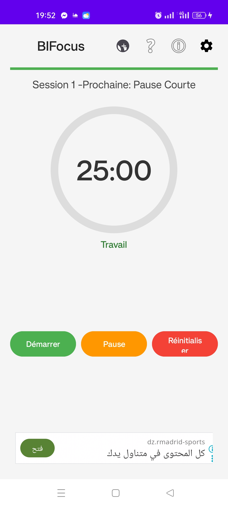
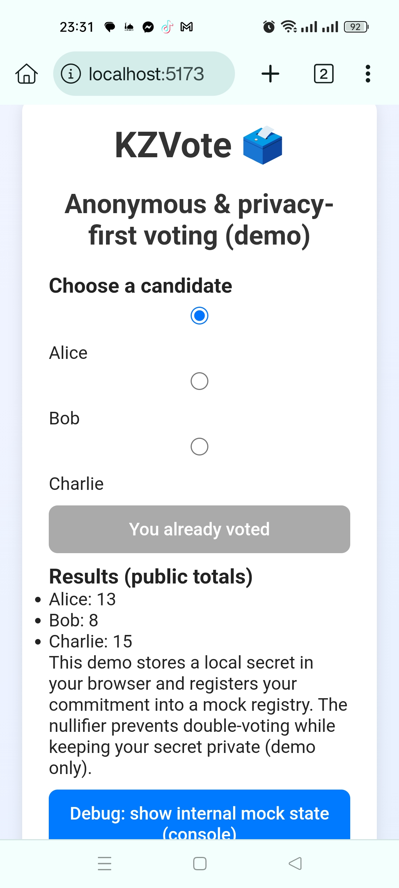
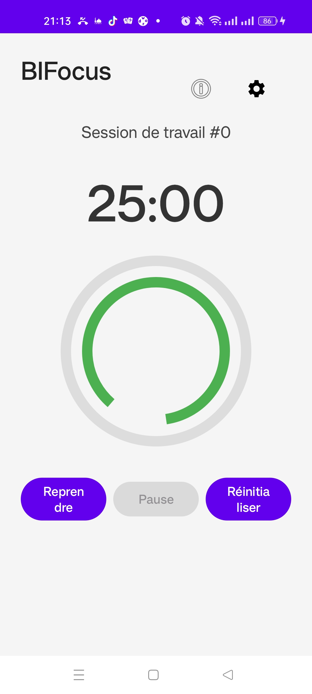

# BIFocus - Timer Pomodoro 📱⏱️

## 📋 Description
BIFocus est une application de productivité basée sur la technique Pomodoro pour améliorer votre concentration.

## ✨ Fonctionnalités
- ✅ Minuteur Pomodoro intelligent
- ✅ Support multi-langues (FR, EN, AR)
- ✅ Statistiques détaillées
- ✅ Interface intuitive
- ✅ Sauvegarde automatique

## 📥 Téléchargement

**Version actuelle :** v1.0.0  
**Taille :** 15 MB  
**Android requis :** 8.0+

## 🖼️ Captures d'écran

## 🔧 Installation
1. Téléchargez l'APK ci-dessus
2. Autorisez l'installation depuis des sources inconnues
3. Installez et profitez !

## 📞 Support
Email : bouchareb.learning@google.com

---
*© 2023 BESMAINFO - Tous droits réservés*